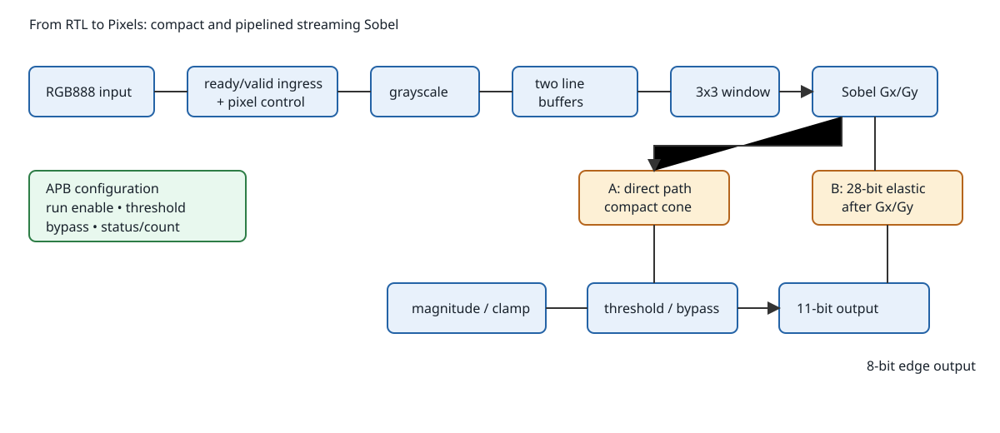
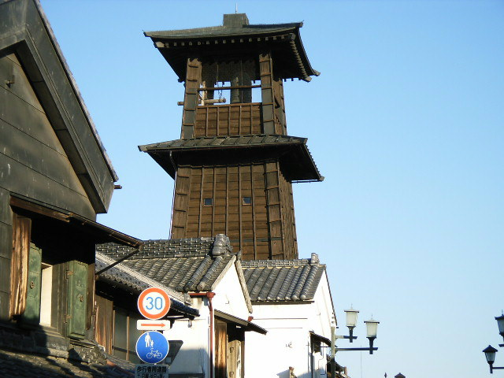
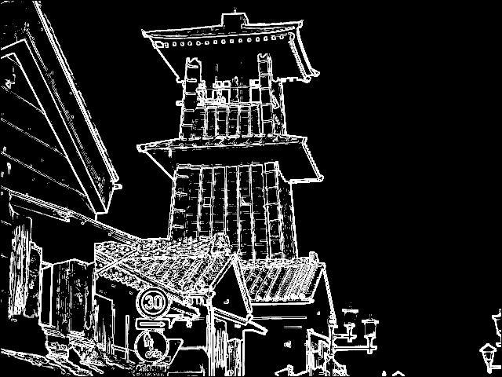

# From RTL to Pixels — Streaming Sobel RTL Accelerator

[](https://github.com/dilanj123/from-rtl-to-pixels/actions/workflows/ci.yml) [](LICENSE)

An original synthesizable SystemVerilog streaming image accelerator: RGB888 → fixed-point grayscale → two line buffers → 3×3 Sobel → threshold/bypass → edge stream. It uses ready/valid backpressure, same-clock APB configuration, an independent Python oracle, cocotb regression, selected formal properties, and open-source ECP5 synthesis/P&R. The project was taken from requirements through routed timing evidence rather than treating RTL compilation as proof of correctness.

**Status: Gate 5 CLOSED — CV-ready project release.** Physical FPGA demonstration is optional follow-on work and is not claimed.

## Results at a glance

Canonical image: 640×480, 307200 accepted inputs and outputs, zero reference mismatches, II=1 and one pixel/clock.

| Metric | A compact | B post-Gx/Gy elastic | Delta |
|---|---:|---:|---:|
| LUT4 | 665 | 775 | +110 (+16.5%) |
| TRELLIS_FF | 194 | 223 | +29 (+14.9%) |
| Clean/fail constraint | 35/40 MHz | 60/65 MHz | +25/+25 MHz |
| Sync path | 25.731 ns | 16.194 ns | -9.537 ns (-37.1%) |
| First output | 642 cycles | 643 cycles | +1 |
| Frame completion | 307842 cycles | 307843 cycles | +1 |
| II / pixels per clock | 1 / 1 | 1 / 1 | unchanged |
| Derived peak rate | 35 Mpixel/s | 60 Mpixel/s | +25 |
| Derived frame rate | 113.695 fps | 194.905 fps | +81.210 |

Timing is a single-seed controlled routed experiment on a virtual ECP5 target, not physical Fmax.

## Why this project

The engineering question is how one controlled ready/valid pipeline boundary changes correctness, latency, sustainable throughput, routed timing, and resource use while holding the workload and implementation conditions constant.

## Architecture



Architecture A is the compact arithmetic cone. Architecture B is the same design with one 28-bit ready/valid elastic boundary immediately after Sobel Gx/Gy. Its token carries final tag, SOF, EOL, border, Gx and Gy so metadata remains aligned.

## Streaming contract

The interface is AXI4-Stream-inspired: transfers occur on `valid && ready`, SOF/EOL travel with the transaction, stalled output data and metadata remain stable, and only accepted input advances image state. APB controls run enable, threshold, bypass, status and frame count.

## Visual result

| Input | Python reference | RTL output | Diff |
|---|---|---|---|
|  |  |  |  |

The displayed diff is zero because the recorded canonical run produced zero pixel mismatches. The direct A/B diff is [here](results/processed/arch-b/arch-a-vs-b-diff.png).

## Verification

The repository covers primitive arithmetic and protocol tests, complete frames, random source gaps, destination backpressure, SOF/EOL and drain stalls, reset and malformed metadata, configuration timing and same-edge APB/SOF priority, 18 deterministic random dimension frames, the 640×480 public image, and direct A/B image equivalence. See [the evidence index](docs/EVIDENCE_INDEX.md) and [the verification plan](docs/VERIFICATION_PLAN.md).

## Formal verification

Selected targeted properties cover elastic stage, APB/configuration, pixel controller, output control and final-token/frame-count integration. This is **not a whole-accelerator formal proof**. Assumptions and limitations are recorded in [FORMAL.md](docs/FORMAL.md).

## Synthesis and routed timing

The comparison uses LFE5U-45F / CABGA381 / speed grade 6, seed 1, and the same Yosys/nextpnr settings. A is clean at 35 MHz and fails at 40 MHz; B is clean at 60 MHz and fails at 65 MHz. Throughput numbers are derived from clean routed constraints and measured II. See [ARCHITECTURE_COMPARISON.md](docs/ARCHITECTURE_COMPARISON.md) and [TIMING.md](docs/TIMING.md).

## Debug case studies

Three deliberate defects were injected on isolated branches after Gate 4: signedness loss, stalled ready/valid output instability, and pipeline metadata misalignment. Each failed its regression, was root-caused and restored; no deliberate defect remains on `main`. See [DEBUG_CASE_STUDIES.md](docs/DEBUG_CASE_STUDIES.md).

## Reproduce it

```sh
git clone https://github.com/dilanj123/from-rtl-to-pixels.git
cd from-rtl-to-pixels
python3 -m venv .venv
source .venv/bin/activate
python -m pip install --upgrade pip
python -m pip install -r requirements-dev.txt
make doctor
make lint
make test-unit
make test
make test-real-image
```

Formal and implementation use the external OSS CAD Suite. Set `OSS_CAD_SUITE_ROOT`, defaulting to `~/.local/share/from-rtl-to-pixels/oss-cad-suite-current`.

```sh
make formal
make synth ARCH=compact
make synth ARCH=pipelined
make timing ARCH=compact FREQ_MHZ=35 SEED=1
make timing ARCH=pipelined FREQ_MHZ=60 SEED=1
make ppa
```

Simulation is simulation evidence; formal applies only to listed properties and assumptions; routed frequencies are virtual-device evidence; throughput is derived; no physical FPGA measurement is claimed.

## Command reference

`make help` lists the supported workflow. `make ci` runs the release smoke suite used by GitHub Actions. `make all` runs the full local evidence workflow. `make clean` removes generated build and simulation products without deleting committed evidence or images.

## Repository structure

`rtl/` contains original SystemVerilog; `tb/` contains the independent model and cocotb tests; `formal/` contains selected formal harnesses; `scripts/` contains reproducible flows; `docs/` contains specifications, evidence and trade-offs; `results/` contains reviewed raw and processed evidence.

## Limitations

See [KNOWN_LIMITATIONS.md](docs/KNOWN_LIMITATIONS.md): no board measurement, single-seed routed timing, selected formal only, compile-time dimensions, one clock domain and no full AXI4-Stream compliance claim.

## Third-party/provenance

Core RTL, reference model, verification, formal properties, A/B experiment and diagram are original project work. The public-domain demo image provenance is recorded in [THIRD_PARTY_NOTICES.md](THIRD_PARTY_NOTICES.md) and [the manifest](docs/THIRD_PARTY_MANIFEST.md).

## Licence

MIT; see [LICENSE](LICENSE).
