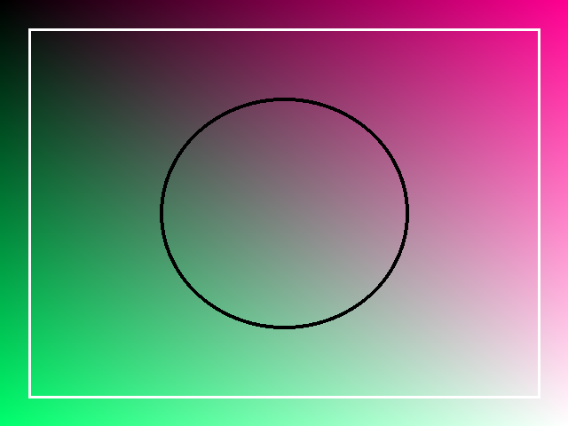
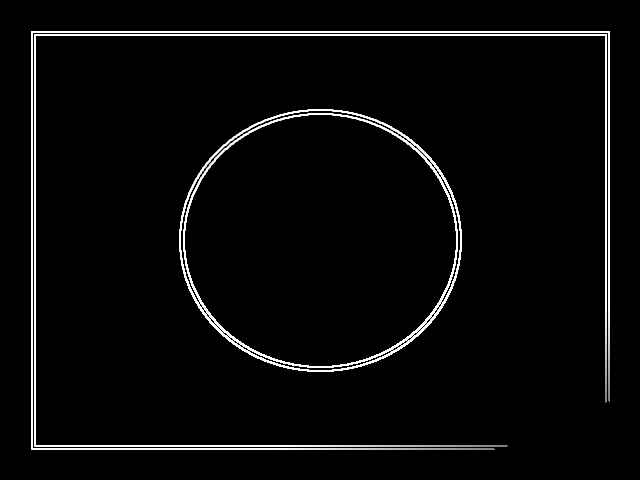

# From RTL to Pixels — Streaming Sobel RTL Accelerator

[](https://github.com/dilanj123/from-rtl-to-pixels/actions/workflows/ci.yml) [](LICENSE)

A synthesizable SystemVerilog image accelerator that streams RGB888 through
grayscale, two line buffers, a 3×3 Sobel operator, thresholding and an edge
output. It handles ready/valid backpressure, APB configuration and frame
completion. Python, cocotb, selected formal checks and open-source ECP5 tools
make the results reproducible.

**Status: Gate 5 CLOSED — CV-ready MVP complete.** Physical FPGA work is an
optional follow-on; no board measurement is claimed.

## See it in 20 seconds

| Input | RTL output | A/B difference |
|---|---|---|
|  |  |  |
|  |  |  |

Both 640×480 runs accepted 307200 inputs and produced 307200 outputs with
zero reference mismatches. The displayed difference images are zero-valued.

## Contents

[See it in 20 seconds](#see-it-in-20-seconds) · [What I built](#what-i-built) · [The result](#the-result) · [Why two architectures?](#why-two-architectures) · [How it works](#how-it-works) · [How I know it works](#how-i-know-it-works) · [Explore the project](#explore-the-project) · [Technical results](#technical-results) · [Reproduce it](#reproduce-it) · [Limitations](#limitations)

## What I built

The project takes a fixed-size RGB stream to a thresholded Sobel edge stream.
The interface is AXI4-Stream-inspired: transfers occur on `valid && ready`,
SOF/EOL travel with each token, and stalled output data and metadata stay
stable. APB controls run enable, threshold, bypass, status and frame count.

## The result

The canonical public image and a project-owned gradient-grid image both match
the independent Python oracle exactly. The integrated regression also covers
source gaps, destination stalls, reset, malformed metadata, configuration
timing, multiple dimensions and 18 deterministic random frames.

## Why two architectures?

Architecture A is the compact baseline. Architecture B makes one controlled
change: a 28-bit ready/valid elastic stage immediately after Sobel Gx/Gy. The
token carries final tag, SOF, EOL, border, Gx and Gy together. B keeps II=1
and one pixel per clock while reducing the measured synchronous path.

## How it works


The complete architecture and frozen interfaces are described in
[Architecture and datapath](docs/MICROARCHITECTURE.md).

## How I know it works

The verification stack combines an independent Python oracle, focused primitive
regressions, complete-frame cocotb tests, streaming/backpressure monitors,
reset and malformed-metadata recovery, APB configuration timing, selected
formal properties and a controlled synthesis/routing comparison. Start with
[full verification evidence](docs/EVIDENCE_INDEX.md) or the
[verification plan](docs/VERIFICATION_PLAN.md).

## Explore the project

| I want to... | Go here |
|---|---|
| Understand the project in two minutes | [This README](README.md) |
| Understand the hardware architecture | [Architecture and datapath](docs/MICROARCHITECTURE.md) |
| Read the exact requirements | [Requirements](docs/REQUIREMENTS.md) |
| See how correctness was tested | [Verification plan](docs/VERIFICATION_PLAN.md) |
| Audit test and result evidence | [Evidence index](docs/EVIDENCE_INDEX.md) |
| Understand formal verification | [Formal verification](docs/FORMAL.md) |
| Inspect routed timing | [Timing](docs/TIMING.md) |
| Compare compact and pipelined versions | [Architecture comparison](docs/ARCHITECTURE_COMPARISON.md) |
| Read debugging case studies | [Debug case studies](docs/DEBUG_CASE_STUDIES.md) |
| See engineering decisions | [Decisions](docs/DECISIONS.md) |
| See limitations | [Known limitations](docs/KNOWN_LIMITATIONS.md) |
| Reproduce the project | [Reproduce it](#reproduce-it) |
| Inspect RTL | [rtl/](rtl/) |
| Inspect tests and reference model | [tb/](tb/) |
| Inspect formal harnesses | [formal/](formal/) |
| Inspect scripts | [scripts/](scripts/) |
| Inspect raw and processed results | [results/](results/) |

## Technical results

| Metric | Architecture A | Architecture B | Delta |
|---|---:|---:|---:|
| LUT4 | 665 | 775 | +110 (+16.5%) |
| TRELLIS_FF | 194 | 223 | +29 (+14.9%) |
| CCU2C | 113 | 110 | -3 |
| DP16KD | 2 | 2 | 0 |
| Clean/fail constraint | 35/40 MHz | 60/65 MHz | +25/+25 MHz |
| Synchronous path | 25.731 ns | 16.194 ns | -9.537 ns |
| First output | 642 cycles | 643 cycles | +1 |
| Frame completion | 307842 cycles | 307843 cycles | +1 |
| II / pixels per clock | 1 / 1 | 1 / 1 | unchanged |
| Derived peak rate | 35 Mpixel/s | 60 Mpixel/s | +25 |
| Derived frame rate | 113.695 fps | 194.905 fps | +81.210 |

These are single-seed controlled routed results on the virtual
LFE5U-45F/CABGA381/speed-6 target. Throughput values are derived from clean
constraints and measured II, not physical measurements. See the full
[Architecture A/B comparison](docs/ARCHITECTURE_COMPARISON.md).

## Reproduce it

```sh
git clone https://github.com/dilanj123/from-rtl-to-pixels.git
cd from-rtl-to-pixels
python3 -m venv .venv
source .venv/bin/activate
python -m pip install --upgrade pip
python -m pip install -r requirements-dev.txt
make doctor
make lint
make test-unit
make test
make test-real-image
```

Formal and implementation use the external OSS CAD Suite. Set
`OSS_CAD_SUITE_ROOT`, defaulting to
`~/.local/share/from-rtl-to-pixels/oss-cad-suite-current`.

```sh
make formal
make synth ARCH=compact
make synth ARCH=pipelined
make timing ARCH=compact FREQ_MHZ=35 SEED=1
make timing ARCH=pipelined FREQ_MHZ=60 SEED=1
make ppa
```

`make help` lists the supported commands. `make ci` runs the smaller GitHub
Actions smoke suite; `make all` runs the full local workflow; `make clean`
removes generated build products without deleting committed evidence or images.

## Repository map

| Path | What is here |
|---|---|
| [`rtl/`](rtl/) | Synthesizable SystemVerilog hardware |
| [`tb/reference/`](tb/reference/) | Independent Python Sobel model |
| [`tb/tests/`](tb/tests/) | cocotb verification |
| [`formal/`](formal/) | Selected formal properties and harnesses |
| [`scripts/`](scripts/) | Reproducible simulation, formal and implementation flows |
| [`docs/`](docs/) | Requirements, architecture, evidence and analysis |
| [`results/raw/`](results/raw/) | Preserved logs and reports |
| [`results/processed/`](results/processed/) | Images and reviewed result artifacts |

## Limitations

There is no physical FPGA demonstration or physical throughput measurement.
Timing is single-seed virtual-device evidence, not a statistically robust Fmax
characterization. Dimensions are compile-time; the design uses one clock, does
not overlap frames during final drain, and is not a full AXI4-Stream,
framebuffer, DMA, CPU, display or CNN system. See [Known limitations](docs/KNOWN_LIMITATIONS.md).

## Formal scope

The selected formal set covers elastic-stage, APB/configuration, pixel-control,
output-control and final-token/frame-count properties under documented
assumptions. It is **not a whole-accelerator formal proof**; see
[Formal verification](docs/FORMAL.md).

## Debug case studies

Three defects were deliberately injected on isolated branches after Gate 4:
signedness loss, stalled ready/valid output instability and pipeline metadata
misalignment. Each failed its regression, was root-caused and restored. No
deliberate defect remains on `main`; see [Debug case studies](docs/DEBUG_CASE_STUDIES.md).

## Provenance and licence

Core RTL, reference model, verification, formal properties, Architecture A/B
experiment and diagram are original project work. The public-domain image
record is in [Third-party notices](THIRD_PARTY_NOTICES.md) and the
[third-party manifest](docs/THIRD_PARTY_MANIFEST.md). The project is released
under the [MIT licence](LICENSE).
